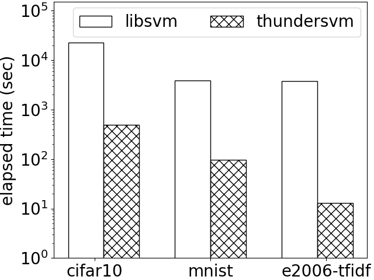

ThunderSVM: A Fast SVM Library
======================================
The mission of ThunderSVM is to help users easily and efficiently apply SVMs to solve problems. Some key features of ThunderSVM are as follows.

* Support one-class, binary and multi-class SVM classification, SVM regression, and SVMs with probability outputs.
* Have Python, R and Matlab interfaces.

## More information about ThunderSVM
* [Getting Started](get-started.md)
* [Introduction](intro.md)
* [Parameters](parameters.md)
* [How To](how-to.md)
* [FAQ](faq.md)